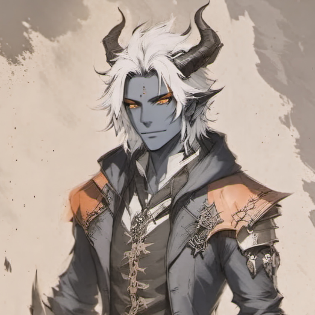

# D&D Campaign Reference (Notion Import)

Welcome to your campaign reference! This file is formatted for easy import into Notion. Each major section is a Notion page. To import:

1. Download all images from your `docs/images/` folder to your computer.
2. Copy this file and all referenced Markdown files into a single folder.
3. In Notion, create a new page, click "Import," and select "Markdown & CSV."
4. Select this folder. Notion will create a page for each Markdown file.
5. After import, upload images to the appropriate Notion pages and replace image links.

---

# CampaignReference

Welcome to the campaign reference site! Here you'll find everything you need to keep track of the story, characters, lore, and more for your Dungeons & Dragons adventure.

## Quick Links
- Campaign Reference
- Locations
- Characters
- Important NPCs
- Lore Books
- House Rules
- Organizations
- Session Notes

---

_Use the navigation menu to explore each section in detail. Happy adventuring!_

---

# Characters

## Player Characters

| Portrait | Name | Played By | Species | Class | Background |
|---|---|---|---|---|---|
|  | Biggus Menethil | Mike | Human (Variant) | Ranger / Rogue | Rune Carver |
|  | Feren Dax | Will | Tiefling | Warlock / Fighter | Criminal |
|  | Milicia Valen | Duwies | Half-Orc | Paladin / Cleric | Gate Warden |
|  | Yo | Ryan | Halfling (Stout) | Druid / Fighter | Folk Hero |

## Family Trees & Lineages
- Valen Family (Dimension Caretakers, rules, history)
- Melicia Valen’s family

[Add backgrounds, patron/deity details, abilities, or notable story moments as they develop.]

---

# Important NPCs

- Headmaster Eldricus (The First One)
- Velistra Dax (Feren’s mother)
- Torri Spellguard (Feren’s childhood friend)
- Niamh (avatar of Ceridwen)
- Others as detailed in campaign

---

# Locations

Detailed locations, settings, and maps (Seraphia, Mogo, other planes/worlds).

---

# House Rules

- House rules (initiative swapping, birthday wish, MTG packs, etc.)
- Cultural lore (The Signet Code, etc.)
- Special abilities and mechanics

---

# Organizations

Factions, hierarchies, and special groups (Gate Keepers, etc.)

---

# Lore Books

In-game books, treatises, and stories.
- Each book/story as a section with title, author, and full text

---

# Session Notes

Recent events, player notes, session summaries, reminders

---

# Feren Dax

## Family Tree & Lineage
(Details to be added)

## Backstory
(Details to be added)

---

# Milicia Valen

## Family Tree & Lineage
(Details to be added)

## Backstory
(Details to be added)

---

# Biggus Menethil

## Family Tree & Lineage
(Details to be added)

## Backstory
(Details to be added)

---

# Start Here

## Where We Left Off
(Add a brief summary of the last session or current campaign state here)

## What to Remember Next Time
(List important reminders, unresolved plot points, or things to do at the start of the next session)

---

# Test Page

Welcome to your test page!

This is a sample page to verify your MkDocs site is working and deploying correctly.

- You can add Markdown content here.
- Use headings, lists, links, images, and more.

**If you see this page on your GitHub Pages site, everything is working!**

---

# Deasile Campaign Reference Sheet

## Table of Contents
1. World & Setting Overview
2. Cultural Lore & House Rules
3. Important Locations
4. Notable NPCs & Player Characters
5. Family Trees & Lineages
6. In-Game Books & Stories
7. Special Abilities & Mechanics
8. Organizations & Hierarchies
9. Recent Events & Player Notes

---

## 1. World & Setting Overview

### Core Setting Lore
- Seraphia: Ancient/futuristic pocket dimension, created by The First One after a cosmic battle with 12 gods.
- Mogo: Living god-planet, source of magical instability, home to extinct and legendary races.
- Cosmology, magic, and history details (see Locations and Lore Books for more).

[See other files for expanded sections.]
