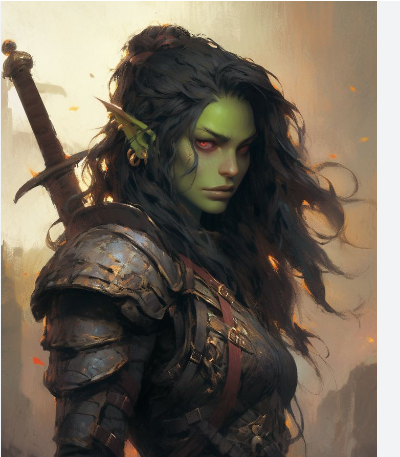

# Compiled: Characters

## Player Characters & Notable NPCs

Sidebar navigation for Important NPCs is handled in mkdocs.yml. No in-content links or sections for Important NPCs are present here.

## Player Characters

<table style="border-collapse:collapse; border-spacing:0; width:100%; padding:0; margin:0;">
  <tr style="vertical-align:top; height:100%; padding:0; margin:0;">
    <!-- Biggus -->
    <td style="width:0%; padding:0; margin:0; height:100%;">
      <table style="border-collapse:collapse; border-spacing:0; width:100%; height:100%; padding:0; margin:0;">
        <tr>
          <td style="vertical-align:top; padding:0; margin:0;">
            
          </td>
          <td style="vertical-align:top; padding:0; margin:0;">
            <strong>Biggus Menethil</strong> 
            <ul style="margin:0 10 0 24px; padding:0 0 0 24px;">
              <li>Played by: Mike</li>
              <li>Species: Human (Variant)</li>
              <li>Class(s): Ranger (lvl) / Rogue (lvl)</li>
              <li>Background: Rune Carver</li>
            </ul>
          </td>
        </tr>
      </table>
    </td>
    <!-- Feren -->
    <td style="width:50%; padding:0; margin:0; height:100%;">
      <table style="border-collapse:collapse; border-spacing:0; width:100%; height:100%; padding:0; margin:0;">
        <tr>
          <td style="vertical-align:top; padding:0; margin:0;">
            
          </td>
          <td style="vertical-align:top; padding:0; margin:0;">
            <strong>Feren Dax</strong> 
            <ul style="margin:0 10 0 24px; padding:0 0 0 24px;">
              <li>Played by: Will</li>
              <li>Species: Tiefling</li>
              <li>Class(s): Warlock (lvl) / Fighter (lvl)</li>
              <li>Background: Criminal</li>
            </ul>
          </td>
        </tr>
      </table>
    </td>
  </tr>
  <tr style="vertical-align:top; height:100%;">
    <!-- Milicia -->
    <td style="width:50%; padding:0; margin:0; height:100%;">
      <table style="border-collapse:collapse; border-spacing:0; width:100%; height:100%; padding:0; margin:0;">
        <tr>
          <td style="vertical-align:top; padding:0; margin:0;">
            
          </td>
          <td style="vertical-align:top; padding:0; margin:0;">
            <strong>Milicia Valen</strong> 
            <ul style="margin:0 10 0 24px; padding:0 0 0 24px;">
              <li>Played by: Duwies</li>
              <li>Species: Half-Orc</li>
              <li>Class(s): Paladin (lvl) / Cleric (lvl)</li>
              <li>Background: Gate Warden</li>
              <li>Dual devotion:
                <ul style="margin:0 10 0 24px; padding:0 0 0 24px;">
                  <li>Shaundakul</li>
                  <li>Gruumsh</li>
                </ul>
              </li>
            </ul>
          </td>
        </tr>
      </table>
    </td>
    <!-- Yo -->
    <td style="width:50%; padding:0; margin:0; height:100%;">
      <table style="border-collapse:collapse; border-spacing:0; width:100%; height:100%; padding:0; margin:0;">
        <tr>
          <td style="vertical-align:top; padding:0; margin:0;">
            
          </td>
          <td style="vertical-align:top; padding:0; margin:0;">
            <strong>Yo</strong> 
            <ul style="margin:0 10 0 24px; padding:0 0 0 24px;">
              <li>Played by: Ryan</li>
              <li>Species: Halfling (Stout)</li>
              <li>Class(s): Druid (lvl) / Fighter (lvl)</li>
              <li>Background: Folk Hero</li>
            </ul>
          </td>
        </tr>
      </table>
    </td>
  </tr>
</table>

---

*This file combines all information from the following sources:*
- Characters.md
- Characters (2).md
- Characters (3).md (empty)
